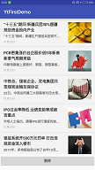

## YtFirstDemo

### 2017年的第一个demo

#### 屏幕适配参考链接

[一分钟了解Android屏幕 ldpi mdpi hdpi xhdpi](http://www.2cto.com/kf/201506/404773.html)

[Android屏幕大小适配问题解决](http://www.2cto.com/kf/201405/301671.html)

[Android屏幕适配小技巧sw<n>dp](http://blog.csdn.net/chenzujie/article/details/9874859)

####  推荐以下开源项目

1.[picasso](https://github.com/square/picasso): 异步图片加载框架！！使用非常简单

2.[volley](https://android.googlesource.com/platform/frameworks/volley): Google 官方推出的网络请求框架！！

3.[butterknife](https://github.com/JakeWharton/butterknife): android 注解框架

4.[eventbus](https://github.com/greenrobot/EventBus): 一个组件间通信的框架！！效果十分赞！！

5.[photoview](https://github.com/chrisbanes/PhotoView):图片随收拾的放大缩小

## Contact Me

- Github: github.com/cheng2016
- Email: mitnick.cheng@outlook.com
- QQ: 1102743539

# License

    Copyright 2017 cheng2016,Inc.

    Licensed under the Apache License, Version 2.0 (the "License");
    you may not use this file except in compliance with the License.
    You may obtain a copy of the License at

        http://www.apache.org/licenses/LICENSE-2.0

    Unless required by applicable law or agreed to in writing, software
    distributed under the License is distributed on an "AS IS" BASIS,
    WITHOUT WARRANTIES OR CONDITIONS OF ANY KIND, either express or implied.
    See the License for the specific language governing permissions and
    limitations under the License.
